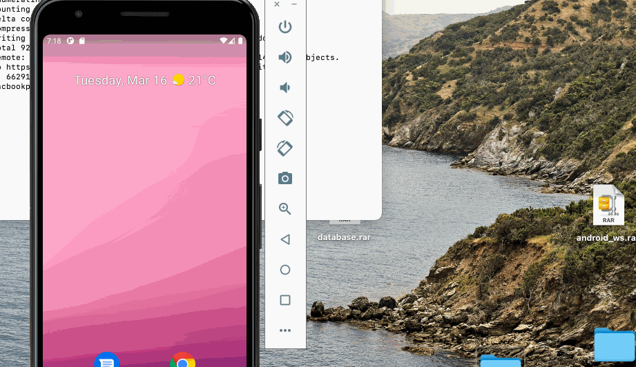

# PopularNYarticles

**PopularNYarticles** is an Android app that fetches the list of popular articles  utilizing [New York Times Article API](http://developer.nytimes.com/docs/).

## Video Walkthrough

Here's a walkthrough of implemented user stories:

## Libraries used

- [Glide](https://github.com/bumptech/glide) - Image loading and caching 
- [Retrofit 2](https://square.github.io/retrofit/) - HTTP client
- [OkHttp 3](http://square.github.io/okhttp/) - HTTP & HTTP/2 client for Android (used in conjunction with Retrofit)
- [Dagger Hilt](https://dagger.dev/hilt/) -  For dependency injection into the application.
-[Androidx] used Coroutines, ViewModel and Navigation component and Room for storing data to local SQLiteDB

## Top Level Design
Here's a top-level design of system:

(assets/system_design.jpg)

## License

    Licensed under the Apache License, Version 2.0 (the "License");
    you may not use this file except in compliance with the License.
    You may obtain a copy of the License at

        http://www.apache.org/licenses/LICENSE-2.0

    Unless required by applicable law or agreed to in writing, software
    distributed under the License is distributed on an "AS IS" BASIS,
    WITHOUT WARRANTIES OR CONDITIONS OF ANY KIND, either express or implied.
    See the License for the specific language governing permissions and
    limitations under the License.
